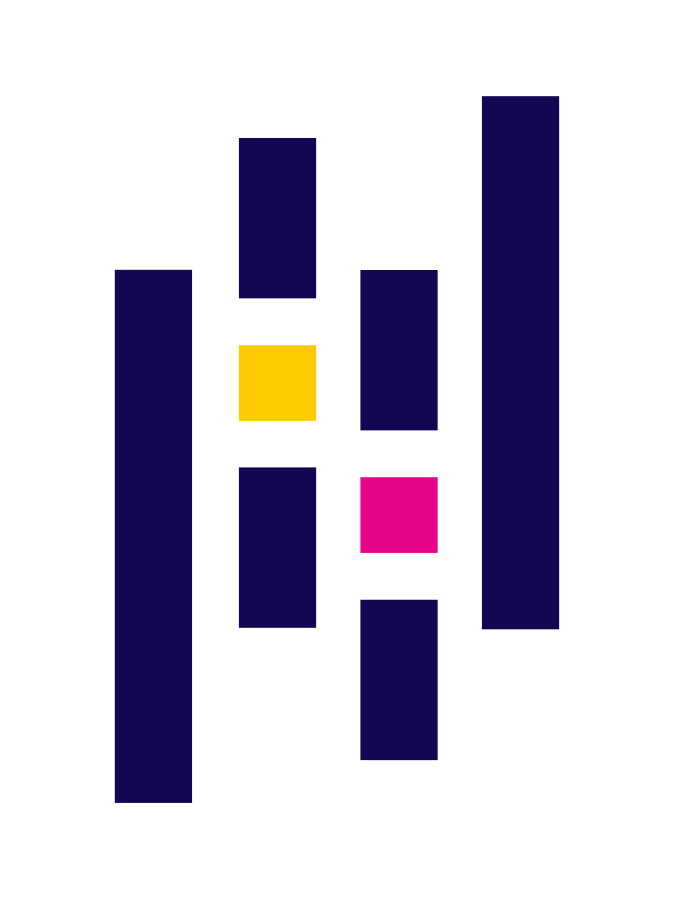

### Hello World!
## About Me 
- 👋 My name is Jesse Peterson
- 🏫 I'm a MSCS candidate at the Georgia Institute of Technology
- 🔭 I’m currently working on a Spotify music project and an e-commerce bookshop
- 🌱 I’ve been teaching myself Power BI as of late
- 📫 How to reach me: message me thru Linkedin or via email: jesse@jmpeterson.dev

 
<h2>My Linkedin</h2>

  

<h2>Tech Stack</h2>

  
 

    
    
    
    
    
    
    
    
    
    
    
    
    
    
    
    
    
    
    <!--  -->

            
